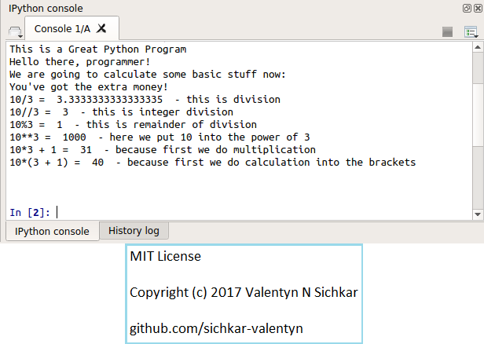

# Introduction in Python
Mathematical operations in Python.

### Reference to:
[1] Valentyn N Sichkar. Mathematical operations in Python // GitHub platform [Electronic resource]. URL: https://github.com/sichkar-valentyn/Introduction_in_Python (date of access: XX.XX.XXXX)

## Description
Using Spyder as IDE for Python here is the simple program which shows how to print information for the user and how to do simple mathematical operations.

## Different mathematical operations in Python

## MIT License
## Copyright (c) 2017 Valentyn N Sichkar
## github.com/sichkar-valentyn
### Reference to:
[1] Valentyn N Sichkar. Mathematical operations in Python // GitHub platform [Electronic resource]. URL: https://github.com/sichkar-valentyn/Introduction_in_Python (date of access: XX.XX.XXXX)
